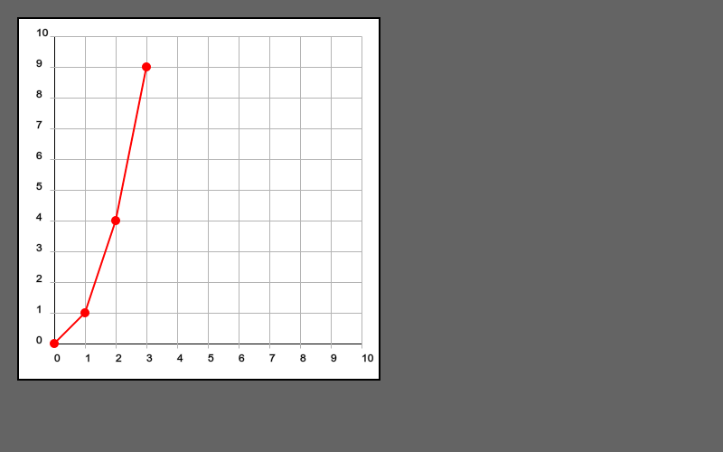

# PhysGraphs
A basic plotting and graphing object.

## Dependencies
This requires the Processing.js library (p5.js) which can be found here http://p5js.org/download/

A CDN for p5.js is https://cdnjs.cloudflare.com/ajax/libs/p5.js/0.4.21/p5.js

##Overview
This library works by declaring a graphing object. Then you can create plot objects and plot them on the graph.

## Declaring a Graph object
To declare a graph, type 
```javascript
var *name* = new Graph(width, height, x_min, x_max, y_min, y_max, resoloution);
```   

**Declaration Attributes**
+ width = the width of the graphing frame.
+ height = the height of the graphing frame.
+ x_min/x_max = the x range on the graph. (numbers that will show up in the graph when plotted)
+ y_min/y_max = the y range on the graph. (numbers that will show up in the graph when plotted)
+ resoloution = how many subdivisions there will be in each of the ranges. As of now the x and y ranges will have the same resoloution.


## Creating a plot
A plot is a collection of point objects. There are two ways to declare a plot. The first way is to manually create an array of point objects and then adding them to a plot object in its declaration statement.   

**An example of a plot of x^2:**  
```javascript
var p1 = new Point(0,0);  
var p2 = new Point(1,1); 
var p3 = new Point(2,4);
var p4 = new Point(3,9);  
var point_array = [p1,p2,p3,p4];  
var plot1 = new Plot(point_array, 255, 0, 0, 2);
```  
This will create a plot of x^2 that is red and has a stroke weight of 2.

The Second way to declare a plot is to use the function 
```javascript  
Graph.makeData(x_array, y_array);
```
. Which returns an array of points from two arrays of x and y coordinates.

**An example of a plot of x^2:**  
```javascript
var xarray = [0,1,2,3];  
var yarray = [0,1,4,9];
var point_array = Graph.makeData(xarray, yarray);  
var plot1 = new Plot(point_array, 255, 0, 0, 2);
```   
This will create the same plot as in the previous example.

## Drawing the plot on the graph

To make the plot show up in the view window you have to add the plot to the graph and then use the graphs plotting commands.

**For Example:**  
```javascript
var graph1 = new Graph(500,500,0,10,0,10,5);  
graph1.addPlot(plot1); //plot1 is the plot created in the previous example
```  

Then in the draw function use the following:  
```javascript  
graph1.drawBg();  
graph1.plotAll();
```
This will plot the following:

